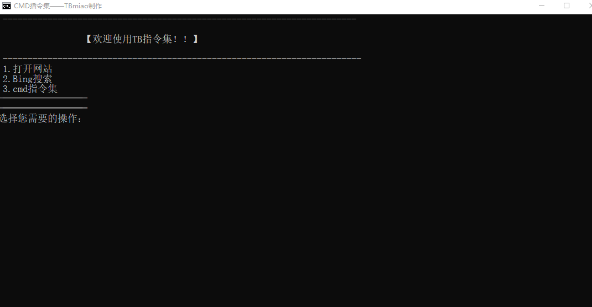

# bat自制脚本
> 里边记录了一些实用的cmd命令。

:exclamation:由于我时间有限所以更新可能慢一点，请大家见谅。:exclamation:

最后更新时间：2024-12-14 PM 6:14
## 功能
1. 查看系统信息
2. 查看电脑IP地址
3. 打开DirectX诊断工具
4. 打开系统配置工具
5. 磁盘清理
6. 关于windows
7. 更改 UAC 设置
8. 安全和维护
9. 计算机管理
10. 系统信息
11. 事件查看器
12. 程序（启动，添加或删除程序和windows 组件）
13. 资源监视器
14. 注册表编辑器

# 更新日志
## 2024-12-14 PM 6:14
> 增加功能：
1. 查看系统信息
2. 查看电脑IP地址
3. 打开DirectX诊断工具
4. 打开系统配置工具
5. 磁盘清理

## 2024-12-15 AM 10:50
> 增加功能：
1. 关于windows
2. 更改 UAC 设置
3. 安全和维护
4. 计算机管理
5. 系统信息
6. 事件查看器
7. 程序（启动，添加或删除程序和windows 组件）
8. 资源监视器
9. 注册表编辑器

> 更改了开头标志

## 截图

## 下载地址
[bat](https://tb-miao.github.io/docs/_media/xz/CMD.bat)
